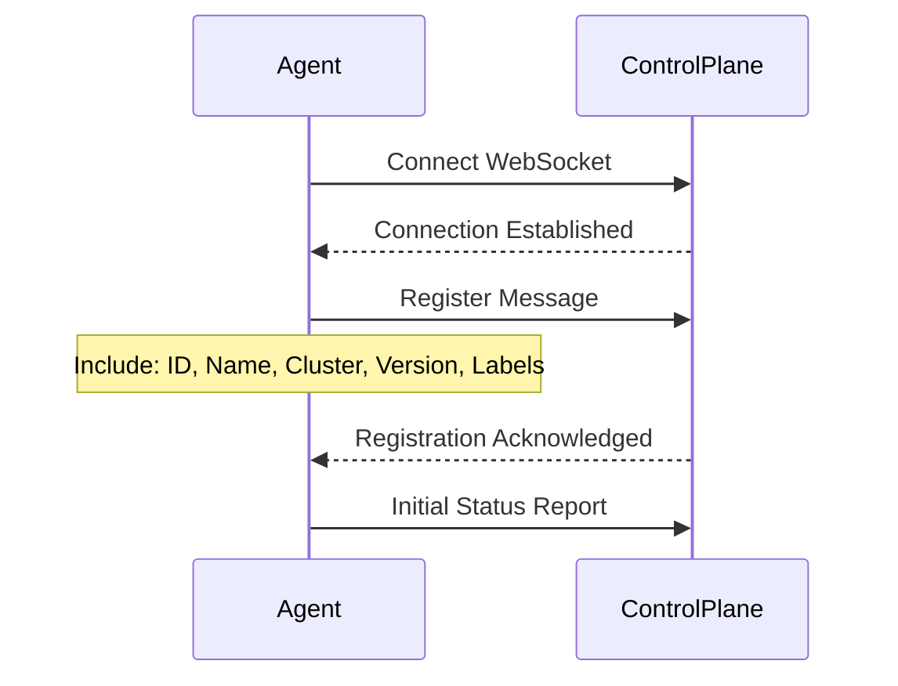
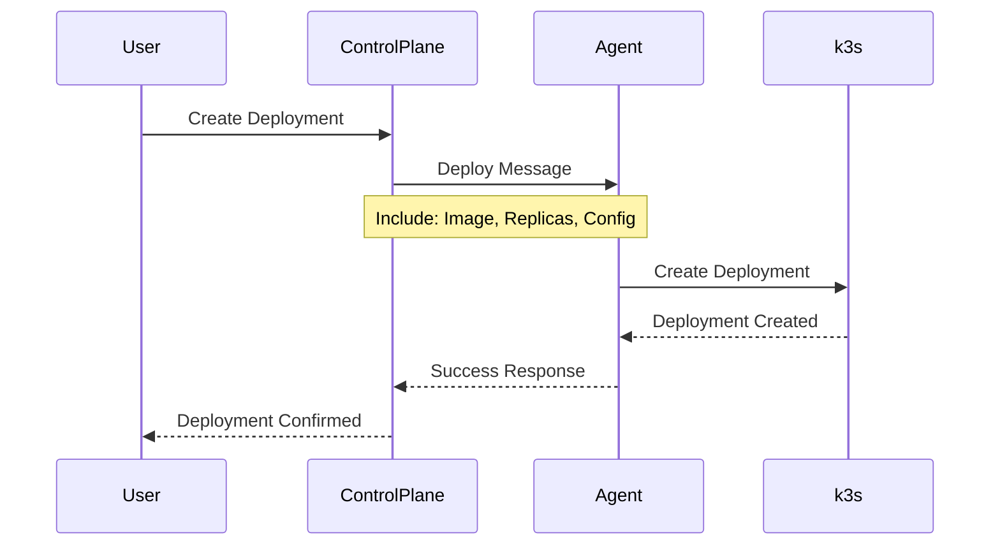
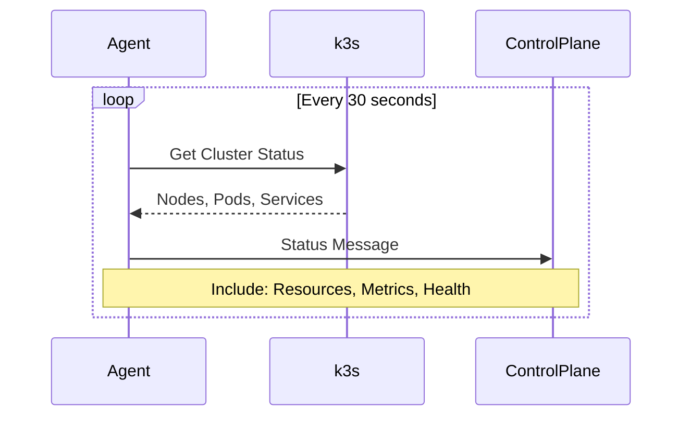

# Architecture Documentation

## Overview

The PipeOps VM Agent is a secure Kubernetes agent that enables management of k3s clusters without exposing the Kubernetes API directly. It acts as a bridge between your k3s cluster and the PipeOps control plane.

## Architecture Diagram

```
┌─────────────────────────────────────────────────────────────────┐
│                         PipeOps Control Plane                   │
│  ┌─────────────────┐ ┌─────────────────┐ ┌─────────────────┐   │
│  │   Dashboard     │ │   API Gateway   │ │   Agent Manager │   │
│  └─────────────────┘ └─────────────────┘ └─────────────────┘   │
└─────────────────────────────────────────────────────────────────┘
                                  │
                                  │ WebSocket/gRPC (TLS)
                                  │ Outbound Only
                                  ▼
┌─────────────────────────────────────────────────────────────────┐
│                        Customer Infrastructure                   │
│  ┌─────────────────────────────────────────────────────────────┐ │
│  │                    k3s Cluster                             │ │
│  │  ┌─────────────────┐ ┌─────────────────┐ ┌───────────────┐ │ │
│  │  │  PipeOps Agent  │ │  User Workloads │ │  k3s Services │ │ │
│  │  │  (Pod)          │ │  (Deployments)  │ │  (System)     │ │ │
│  │  └─────────────────┘ └─────────────────┘ └───────────────┘ │ │
│  └─────────────────────────────────────────────────────────────┘ │
│                                                                  │
│  ┌─────────────────────────────────────────────────────────────┐ │
│  │                    Host System                              │ │
│  │  • Ubuntu/Debian/CentOS/RHEL                              │ │
│  │  • Docker Engine                                           │ │
│  │  • k3s (Lightweight Kubernetes)                           │ │
│  └─────────────────────────────────────────────────────────────┘ │
└─────────────────────────────────────────────────────────────────┘
```

## Components

### 1. PipeOps Agent (`internal/agent`)

The main agent component that orchestrates all operations:

- **Registration**: Registers with the PipeOps control plane
- **Heartbeat**: Maintains connection and reports health
- **Status Reporting**: Periodic cluster status updates
- **Command Handling**: Processes deployment, scaling, and management commands

### 2. Communication Layer (`internal/communication`)

Handles secure communication with the control plane:

- **WebSocket Client**: Persistent, real-time communication
- **Message Handling**: Type-safe message processing
- **Reconnection Logic**: Automatic reconnection with exponential backoff
- **TLS Security**: End-to-end encryption

### 3. Kubernetes Client (`internal/k8s`)

Wraps the Kubernetes client with PipeOps-specific functionality:

- **Cluster Monitoring**: Node, pod, and service status collection
- **Resource Management**: Deployment creation, updates, and deletion
- **Log Retrieval**: Pod log streaming and collection
- **Metrics Collection**: Basic cluster resource metrics

### 4. Type System (`pkg/types`)

Defines all data structures and interfaces:

- **Message Types**: Request/response message definitions
- **Resource Types**: Kubernetes resource representations
- **Configuration**: Agent and connection configuration
- **Status Types**: Health and status reporting structures

## Data Flow

### 1. Agent Registration Flow



### 2. Deployment Flow



### 3. Status Reporting Flow



## Security Model

### 1. Network Security

- **Outbound Only**: Agent only makes outbound connections
- **TLS Encryption**: All communication encrypted with TLS 1.3
- **Certificate Validation**: Strict certificate validation
- **No Ingress**: No inbound ports required on customer infrastructure

### 2. Authentication

- **Token-Based**: Agent authenticates using a secure token
- **Short-Lived Tokens**: Tokens can be rotated frequently
- **Scope Limitation**: Tokens are scoped to specific clusters

### 3. Authorization

- **RBAC Integration**: Uses Kubernetes RBAC for permissions
- **Principle of Least Privilege**: Minimal required permissions
- **Namespace Isolation**: Can be restricted to specific namespaces
- **Resource Limitations**: Configurable resource access controls

### 4. Container Security

- **Non-Root User**: Runs as non-root user (UID 1000)
- **Read-Only Filesystem**: Root filesystem is read-only
- **No Privileged Access**: No privileged container access
- **Capability Dropping**: All unnecessary capabilities dropped
- **Security Contexts**: Comprehensive security context configuration

## Deployment Strategies

### 1. Single-Node Deployment

Ideal for development, testing, or small production workloads:

```bash
# Install k3s and agent in one command
curl -sSL https://get.pipeops.io/agent | bash
```

### 2. Multi-Node Deployment

For production clusters with multiple nodes:

```bash
# Master node
export K3S_TOKEN="your-cluster-token"
curl -sSL https://get.k3s.io | sh -s - server

# Worker nodes
export K3S_URL="https://master-ip:6443"
export K3S_TOKEN="your-cluster-token"
curl -sSL https://get.k3s.io | sh -s - agent

# Deploy PipeOps agent on master
kubectl apply -f https://raw.githubusercontent.com/pipeops/agent/main/deployments/agent.yaml
```

### 3. High Availability Deployment

For production environments requiring high availability:

```bash
# Setup embedded etcd cluster
curl -sSL https://get.k3s.io | sh -s - server --cluster-init
# Additional master nodes join the cluster
curl -sSL https://get.k3s.io | sh -s - server --server https://first-master:6443
```

## Configuration

### 1. Environment Variables

| Variable | Description | Default |
|----------|-------------|---------|
| `PIPEOPS_API_URL` | PipeOps control plane URL | `https://api.pipeops.io` |
| `PIPEOPS_TOKEN` | Authentication token | Required |
| `PIPEOPS_CLUSTER_NAME` | Cluster identifier | `default-cluster` |
| `PIPEOPS_LOG_LEVEL` | Logging level | `info` |
| `PIPEOPS_POLL_INTERVAL` | Status report interval | `30s` |

### 2. Configuration File

```yaml
# ~/.pipeops-agent.yaml
agent:
  cluster_name: "production-east"
  poll_interval: "30s"
  labels:
    environment: "production"
    region: "us-east-1"

pipeops:
  api_url: "https://api.pipeops.io"
  token: "your-token-here"
  reconnect:
    enabled: true
    max_attempts: 10
    interval: "5s"

kubernetes:
  in_cluster: true
  namespace: "pipeops-system"

logging:
  level: "info"
  format: "json"
```

## Monitoring and Observability

### 1. Health Checks

The agent provides health endpoints:

- **Liveness**: `/health` - Agent is running
- **Readiness**: `/ready` - Agent is connected and operational

### 2. Metrics

Exposed Prometheus metrics on port 8090:

- `pipeops_agent_connection_status` - Connection status to control plane
- `pipeops_agent_messages_total` - Total messages sent/received
- `pipeops_agent_errors_total` - Total errors encountered
- `pipeops_cluster_nodes_total` - Number of cluster nodes
- `pipeops_cluster_pods_total` - Number of pods in cluster

### 3. Logging

Structured JSON logging with configurable levels:

```json
{
  "time": "2024-01-15T10:30:00Z",
  "level": "info",
  "msg": "Deployment created successfully",
  "component": "agent",
  "deployment": "my-app",
  "namespace": "default"
}
```

## Troubleshooting

### 1. Common Issues

#### Agent Won't Connect

```bash
# Check network connectivity
curl -v https://api.pipeops.io/health

# Check token validity
kubectl logs deployment/pipeops-agent -n pipeops-system

# Verify configuration
kubectl get secret pipeops-agent-config -n pipeops-system -o yaml
```

#### Deployments Failing

```bash
# Check RBAC permissions
kubectl auth can-i create deployments --as=system:serviceaccount:pipeops-system:pipeops-agent

# Check resource quotas
kubectl describe resourcequota -A

# Check node resources
kubectl top nodes
```

### 2. Debug Mode

Enable debug logging:

```bash
kubectl set env deployment/pipeops-agent PIPEOPS_LOG_LEVEL=debug -n pipeops-system
```

### 3. Agent Logs

View real-time logs:

```bash
kubectl logs -f deployment/pipeops-agent -n pipeops-system
```

## Performance Considerations

### 1. Resource Requirements

| Component | CPU Request | Memory Request | CPU Limit | Memory Limit |
|-----------|-------------|----------------|-----------|--------------|
| Agent | 100m | 128Mi | 500m | 512Mi |

### 2. Scaling Considerations

- **Single Agent**: One agent per cluster (recommended)
- **Connection Limits**: Each agent maintains one WebSocket connection
- **Message Throughput**: ~1000 messages/second per agent
- **Cluster Size**: Tested with clusters up to 100 nodes

### 3. Network Requirements

- **Bandwidth**: ~1KB/s baseline, ~10KB/s during deployments
- **Latency**: <500ms recommended for responsive operations
- **Reliability**: Connection automatically recovers from intermittent issues

## Future Enhancements

### 1. Planned Features

- **Multi-Cluster Support**: Single agent managing multiple clusters
- **Custom Resources**: Support for custom Kubernetes resources
- **GitOps Integration**: Native GitOps workflow support
- **Service Mesh**: Istio/Linkerd integration
- **Backup/Restore**: Automated cluster backup and restore

### 2. Extensibility

- **Plugin System**: Support for custom plugins
- **Webhook Support**: Custom validation and mutation webhooks
- **Custom Metrics**: User-defined metrics collection
- **Event Handling**: Custom event processing and forwarding
