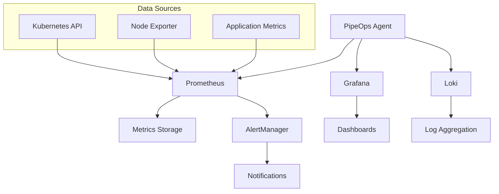

# Advanced Monitoring

The PipeOps Kubernetes Agent includes a comprehensive monitoring stack built on industry-standard tools. This guide covers advanced monitoring configuration, custom metrics, alerting, and troubleshooting.

## Monitoring Stack Overview

The agent deploys a complete observability platform:



### Components

| Component | Purpose | Port | URL |
|-----------|---------|------|-----|
| **Prometheus** | Metrics collection and storage | 9090 | `http://localhost:9090` |
| **Grafana** | Visualization and dashboards | 3000 | `http://localhost:3000` |
| **Loki** | Log aggregation and search | 3100 | `http://localhost:3100` |
| **AlertManager** | Alert routing and notifications | 9093 | `http://localhost:9093` |

## Quick Start

### Access Dashboards

Forward ports to access monitoring interfaces:

```bash
# Grafana dashboard
kubectl port-forward -n pipeops-system svc/grafana 3000:3000

# Prometheus UI
kubectl port-forward -n pipeops-system svc/prometheus 9090:9090

# Loki (for log queries)
kubectl port-forward -n pipeops-system svc/loki 3100:3100
```

### Default Credentials

=== "Grafana"

    - **URL**: http://localhost:3000
    - **Username**: `admin`
    - **Password**: Get with command below
    
    ```bash
    kubectl get secret -n pipeops-system grafana-admin-password \
      -o jsonpath='{.data.password}' | base64 -d
    ```

=== "Prometheus"

    - **URL**: http://localhost:9090
    - **Authentication**: None (internal access only)

=== "AlertManager"

    - **URL**: http://localhost:9093  
    - **Authentication**: None (internal access only)

## Pre-built Dashboards

The agent includes comprehensive dashboards for monitoring your cluster:

### Kubernetes Overview
- Cluster resource utilization
- Node health and capacity
- Pod status and distribution
- Network traffic and errors

### Application Monitoring
- Application performance metrics
- Error rates and response times
- Resource consumption by application
- Custom application metrics

### Infrastructure Health
- Node resource usage (CPU, memory, disk)
- Storage utilization and IOPS
- Network connectivity and latency
- System-level metrics

### PipeOps Agent
- Agent health and connectivity
- Control plane communication
- Monitoring stack health
- Performance metrics

## Custom Metrics

### Exposing Application Metrics

Add Prometheus metrics to your applications:

=== "Go Application"

    ```go
    package main
    
    import (
        "github.com/prometheus/client_golang/prometheus"
        "github.com/prometheus/client_golang/prometheus/promhttp"
        "net/http"
    )
    
    var (
        requestsTotal = prometheus.NewCounterVec(
            prometheus.CounterOpts{
                Name: "myapp_requests_total",
                Help: "Total number of requests",
            },
            []string{"method", "status"},
        )
        
        requestDuration = prometheus.NewHistogramVec(
            prometheus.HistogramOpts{
                Name: "myapp_request_duration_seconds",
                Help: "Request duration in seconds",
            },
            []string{"method"},
        )
    )
    
    func init() {
        prometheus.MustRegister(requestsTotal)
        prometheus.MustRegister(requestDuration)
    }
    
    func main() {
        http.HandleFunc("/api/users", func(w http.ResponseWriter, r *http.Request) {
            timer := prometheus.NewTimer(requestDuration.WithLabelValues(r.Method))
            defer timer.ObserveDuration()
            
            // Your application logic here
            
            requestsTotal.WithLabelValues(r.Method, "200").Inc()
        })
        
        // Expose metrics endpoint
        http.Handle("/metrics", promhttp.Handler())
        http.ListenAndServe(":8080", nil)
    }
    ```

=== "Python Application"

    ```python
    from prometheus_client import Counter, Histogram, start_http_server
    from flask import Flask
    import time
    
    app = Flask(__name__)
    
    # Define metrics
    REQUEST_COUNT = Counter(
        'myapp_requests_total',
        'Total number of requests',
        ['method', 'status']
    )
    
    REQUEST_DURATION = Histogram(
        'myapp_request_duration_seconds',
        'Request duration in seconds',
        ['method']
    )
    
    @app.route('/api/users')
    def users():
        start_time = time.time()
        
        # Your application logic here
        
        # Record metrics
        duration = time.time() - start_time
        REQUEST_DURATION.labels(method='GET').observe(duration)
        REQUEST_COUNT.labels(method='GET', status='200').inc()
        
        return {'users': []}
    
    if __name__ == '__main__':
        # Start metrics server
        start_http_server(8000)
        app.run(host='0.0.0.0', port=8080)
    ```

=== "Node.js Application"

    ```javascript
    const express = require('express');
    const prometheus = require('prom-client');
    
    const app = express();
    const port = 8080;
    
    // Create metrics
    const requestsTotal = new prometheus.Counter({
      name: 'myapp_requests_total',
      help: 'Total number of requests',
      labelNames: ['method', 'status']
    });
    
    const requestDuration = new prometheus.Histogram({
      name: 'myapp_request_duration_seconds',
      help: 'Request duration in seconds',
      labelNames: ['method']
    });
    
    // Register metrics
    prometheus.register.registerMetric(requestsTotal);
    prometheus.register.registerMetric(requestDuration);
    
    // Middleware to track metrics
    app.use((req, res, next) => {
      const startTime = Date.now();
      
      res.on('finish', () => {
        const duration = (Date.now() - startTime) / 1000;
        requestDuration.labels(req.method).observe(duration);
        requestsTotal.labels(req.method, res.statusCode).inc();
      });
      
      next();
    });
    
    app.get('/api/users', (req, res) => {
      // Your application logic here
      res.json({ users: [] });
    });
    
    // Metrics endpoint
    app.get('/metrics', (req, res) => {
      res.set('Content-Type', prometheus.register.contentType);
      res.end(prometheus.register.metrics());
    });
    
    app.listen(port, () => {
      console.log(`App listening on port ${port}`);
    });
    ```

### ServiceMonitor Configuration

Configure Prometheus to scrape your application metrics:

```yaml
apiVersion: monitoring.coreos.com/v1
kind: ServiceMonitor
metadata:
  name: myapp-monitor
  namespace: pipeops-system
  labels:
    app: myapp
spec:
  selector:
    matchLabels:
      app: myapp
  endpoints:
  - port: metrics
    interval: 30s
    path: /metrics
    scrapeTimeout: 10s
```

### Kubernetes Service

Ensure your application service exposes the metrics port:

```yaml
apiVersion: v1
kind: Service
metadata:
  name: myapp-service
  labels:
    app: myapp
spec:
  selector:
    app: myapp
  ports:
  - name: http
    port: 8080
    targetPort: 8080
  - name: metrics
    port: 8000
    targetPort: 8000
```

## Alerting

### Alert Rules

Configure custom alert rules for your applications:

```yaml
# Custom alert rules
apiVersion: monitoring.coreos.com/v1
kind: PrometheusRule
metadata:
  name: myapp-alerts
  namespace: pipeops-system
spec:
  groups:
  - name: myapp.rules
    rules:
    # High error rate
    - alert: HighErrorRate
      expr: |
        sum(rate(myapp_requests_total{status=~"5.."}[5m])) /
        sum(rate(myapp_requests_total[5m])) > 0.05
      for: 5m
      labels:
        severity: warning
      annotations:
        summary: "High error rate detected"
        description: "Error rate is {{ $value | humanizePercentage }}"
    
    # High response time
    - alert: HighResponseTime
      expr: |
        histogram_quantile(0.95, 
          rate(myapp_request_duration_seconds_bucket[5m])
        ) > 0.5
      for: 5m
      labels:
        severity: warning
      annotations:
        summary: "High response time detected"
        description: "95th percentile response time is {{ $value }}s"
    
    # Application down
    - alert: ApplicationDown
      expr: up{job="myapp"} == 0
      for: 1m
      labels:
        severity: critical
      annotations:
        summary: "Application is down"
        description: "Application {{ $labels.instance }} is down"
```

### Notification Channels

Configure AlertManager to send notifications:

```yaml
# AlertManager configuration
apiVersion: v1
kind: ConfigMap
metadata:
  name: alertmanager-config
  namespace: pipeops-system
data:
  alertmanager.yml: |
    global:
      smtp_smarthost: 'localhost:587'
      smtp_from: 'alerts@pipeops.io'
    
    route:
      group_by: ['alertname']
      group_wait: 30s
      group_interval: 5m
      repeat_interval: 12h
      receiver: 'web.hook'
      routes:
      - match:
          severity: critical
        receiver: 'critical-alerts'
      - match:
          severity: warning
        receiver: 'warning-alerts'
    
    receivers:
    - name: 'web.hook'
      webhook_configs:
      - url: 'http://webhook.example.com/alerts'
    
    - name: 'critical-alerts'
      email_configs:
      - to: 'oncall@pipeops.io'
        subject: 'CRITICAL: {{ .GroupLabels.alertname }}'
        body: |
          {{ range .Alerts }}
          Alert: {{ .Annotations.summary }}
          Description: {{ .Annotations.description }}
          {{ end }}
      slack_configs:
      - api_url: 'YOUR_SLACK_WEBHOOK_URL'
        channel: '#alerts'
        title: 'CRITICAL Alert'
        text: '{{ range .Alerts }}{{ .Annotations.summary }}{{ end }}'
    
    - name: 'warning-alerts'
      email_configs:
      - to: 'team@pipeops.io'
        subject: 'WARNING: {{ .GroupLabels.alertname }}'
```

## Custom Dashboards

### Creating Custom Grafana Dashboards

Create dashboards for your specific monitoring needs:

```json
{
  "dashboard": {
    "title": "My Application Dashboard",
    "panels": [
      {
        "title": "Request Rate",
        "type": "graph",
        "targets": [
          {
            "expr": "rate(myapp_requests_total[5m])",
            "legendFormat": "{{ method }} {{ status }}"
          }
        ],
        "yAxes": [
          {
            "label": "Requests/sec"
          }
        ]
      },
      {
        "title": "Response Time",
        "type": "graph",
        "targets": [
          {
            "expr": "histogram_quantile(0.95, rate(myapp_request_duration_seconds_bucket[5m]))",
            "legendFormat": "95th percentile"
          },
          {
            "expr": "histogram_quantile(0.50, rate(myapp_request_duration_seconds_bucket[5m]))",
            "legendFormat": "50th percentile"
          }
        ],
        "yAxes": [
          {
            "label": "Seconds"
          }
        ]
      }
    ]
  }
}
```

### Dashboard Configuration

Add dashboards via ConfigMap:

```yaml
apiVersion: v1
kind: ConfigMap
metadata:
  name: custom-dashboards
  namespace: pipeops-system
  labels:
    grafana_dashboard: "1"
data:
  myapp-dashboard.json: |
    {
      "dashboard": {
        // Dashboard JSON here
      }
    }
```

## Log Management

### Structured Logging

Configure applications to output structured logs:

=== "JSON Format"

    ```json
    {
      "timestamp": "2023-10-26T15:30:00Z",
      "level": "INFO",
      "message": "User login successful",
      "user_id": "12345",
      "ip_address": "192.168.1.100",
      "duration_ms": 150
    }
    ```

=== "Go Logrus"

    ```go
    import "github.com/sirupsen/logrus"
    
    log := logrus.New()
    log.SetFormatter(&logrus.JSONFormatter{})
    
    log.WithFields(logrus.Fields{
        "user_id": "12345",
        "ip_address": "192.168.1.100",
        "duration_ms": 150,
    }).Info("User login successful")
    ```

=== "Python Structlog"

    ```python
    import structlog
    
    logger = structlog.get_logger()
    logger.info(
        "User login successful",
        user_id="12345",
        ip_address="192.168.1.100",
        duration_ms=150
    )
    ```

### Log Queries

Use LogQL to query logs in Grafana:

```logql
# All logs for a specific application
{app="myapp"}

# Error logs only
{app="myapp"} |= "ERROR"

# Logs with specific field
{app="myapp"} | json | user_id="12345"

# Rate of errors over time
rate({app="myapp"} |= "ERROR" [5m])

# Top error messages
topk(10, 
  sum by (message) (
    rate({app="myapp"} |= "ERROR" | json [5m])
  )
)
```

### Log-based Metrics

Create metrics from log data:

```yaml
# Prometheus recording rule from logs
groups:
- name: log-metrics
  rules:
  - record: myapp:error_rate
    expr: |
      sum(rate({app="myapp"} |= "ERROR" [5m])) /
      sum(rate({app="myapp"} [5m]))
```

## Advanced Configuration

### High Availability Setup

Configure monitoring stack for high availability:

```yaml
# Prometheus with multiple replicas
prometheus:
  replicas: 2
  retention: 30d
  storage:
    size: 100Gi
    class: fast-ssd
  resources:
    requests:
      cpu: 500m
      memory: 1Gi
    limits:
      cpu: 2000m
      memory: 4Gi

# Grafana with persistent storage
grafana:
  replicas: 2
  persistence:
    enabled: true
    size: 20Gi
  database:
    type: postgres
    host: postgres.monitoring.svc.cluster.local

# Loki with S3 storage
loki:
  replicas: 3
  storage:
    type: s3
    s3:
      bucket: loki-logs
      region: us-west-2
```

### External Data Sources

Connect to external monitoring systems:

```yaml
# External Prometheus
datasources:
- name: External Prometheus
  type: prometheus
  url: https://prometheus.external.com
  access: proxy
  headers:
    Authorization: Bearer ${EXTERNAL_TOKEN}

# External Loki
- name: External Loki
  type: loki
  url: https://loki.external.com
  access: proxy
```

### Metric Federation

Set up Prometheus federation for multi-cluster monitoring:

```yaml
# Federation configuration
- job_name: 'federate'
  scrape_interval: 15s
  honor_labels: true
  metrics_path: '/federate'
  params:
    'match[]':
      - '{job=~"kubernetes-.*"}'
      - '{__name__=~"job:.*"}'
  static_configs:
    - targets:
      - 'prometheus-cluster-1:9090'
      - 'prometheus-cluster-2:9090'
```

## Monitoring Best Practices

### 1. Metric Naming Conventions

```text
# Counter metrics (always increasing)
myapp_requests_total
myapp_errors_total

# Gauge metrics (can go up or down)
myapp_active_connections
myapp_queue_size

# Histogram metrics (observations)
myapp_request_duration_seconds
myapp_response_size_bytes

# Summary metrics (quantiles)
myapp_request_duration_summary
```

### 2. Label Best Practices

```yaml
# Good labels (low cardinality)
labels:
  - method: GET/POST/PUT/DELETE
  - status: 2xx/4xx/5xx
  - service: user-service/order-service

# Avoid high cardinality labels
# Bad examples:
# - user_id: "12345" (thousands of users)
# - timestamp: "2023-10-26T15:30:00Z"
# - request_id: "uuid-here"
```

### 3. Alert Design

```yaml
# Good alert rules
- alert: HighErrorRate
  expr: |
    sum(rate(http_requests_total{status=~"5.."}[5m])) by (service) /
    sum(rate(http_requests_total[5m])) by (service) > 0.05
  for: 5m
  
# Include context in annotations
annotations:
  summary: "High error rate for {{ $labels.service }}"
  description: |
    Error rate is {{ $value | humanizePercentage }}
    Current traffic: {{ with query "sum(rate(http_requests_total[5m])) by (service)" }}{{ . | first | value | humanize }}{{ end }} req/s
```

## Troubleshooting

### Common Issues

??? question "Metrics not appearing in Prometheus"

    **Check ServiceMonitor configuration**:
    ```bash
    kubectl get servicemonitor -n pipeops-system
    kubectl describe servicemonitor myapp-monitor -n pipeops-system
    ```
    
    **Verify service labels match**:
    ```bash
    kubectl get service myapp-service -o yaml
    ```
    
    **Check Prometheus targets**:
    - Open Prometheus UI: http://localhost:9090
    - Go to Status → Targets
    - Look for your application in the list

??? question "Grafana dashboard not loading data"

    **Check data source configuration**:
    - Go to Configuration → Data Sources
    - Test the Prometheus connection
    - Verify the URL is correct
    
    **Check query syntax**:
    - Use Prometheus UI to test queries first
    - Ensure metric names are correct
    - Verify label selectors match your data

??? question "Alerts not firing"

    **Verify alert rules**:
    ```bash
    kubectl get prometheusrule -n pipeops-system
    ```
    
    **Check AlertManager configuration**:
    - Open AlertManager UI: http://localhost:9093
    - Verify routing and receivers
    - Check notification channels

### Debug Commands

```bash
# Check monitoring stack health
pipeops-agent status --component=monitoring

# View Prometheus configuration
kubectl get prometheus -n pipeops-system -o yaml

# Check Grafana pods
kubectl logs -f deployment/grafana -n pipeops-system

# Debug Loki
kubectl logs -f statefulset/loki -n pipeops-system
```

---

**Related Guides**: [Configuration](../getting-started/configuration.md) | [Architecture](../ARCHITECTURE.md)