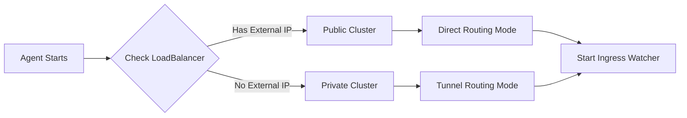

# PipeOps Gateway Proxy

The PipeOps Gateway Proxy is an **optional feature** that provides external access to applications in private Kubernetes clusters. It is **DISABLED by default** for security.

**Important**: Enable this feature only if you want to expose your cluster services externally. For secure admin access only, keep it disabled (default).

## Overview

When enabled, the PipeOps Gateway Proxy provides:

- **Private cluster support** - No public IP addresses required
- **Automatic ingress detection** - Monitors all ingress resources
- **Route registration** - Registers routes with controller via REST API
- **Custom domains** - Full support for custom domain mapping
- **TLS termination** - Secure HTTPS access at gateway level
- **Dual routing modes** - Optimized routing based on cluster type

## Enabling Gateway Proxy

Gateway proxy is **DISABLED by default**. To enable it:

```yaml
# In agent ConfigMap
agent:
  enable_ingress_sync: true  # Default: false
```

Or via environment variable:
```bash
export ENABLE_INGRESS_SYNC=true
```

Then restart the agent:
```bash
kubectl rollout restart deployment/pipeops-agent -n pipeops-system
```

## How It Works

### Automatic Cluster Detection

When the agent starts, it automatically detects your cluster type:



**Detection Logic:**

- Checks for `ingress-nginx-controller` service
- Verifies if it's a LoadBalancer type
- Waits up to 2 minutes for external IP assignment
- Returns `isPrivate=true` if no external IP

### Routing Modes

#### Direct Routing (Public Clusters)

For clusters with public LoadBalancer IPs:

```text
User Request
    ↓
DNS Resolution
    ↓
Gateway Proxy (Controller)
    ↓
LoadBalancer IP (203.0.113.45:80)
    ↓
Ingress Controller
    ↓
Service → Pod
```

**Benefits:**
- 3-5x faster than tunnel mode
- Lower bandwidth usage
- Reduced controller load
- No tunnel overhead

#### Tunnel Routing (Private Clusters)

For clusters without public IPs:

```text
User Request
    ↓
DNS Resolution
    ↓
Gateway Proxy (Controller)
    ↓
WebSocket Tunnel
    ↓
Agent in Private Cluster
    ↓
Ingress Controller
    ↓
Service → Pod
```

**Benefits:**
- Works in private networks
- No inbound firewall rules needed
- Secure by default
- Zero configuration required

## Ingress Route Discovery

The agent automatically watches all ingress resources:

```yaml
apiVersion: networking.k8s.io/v1
kind: Ingress
metadata:
  name: my-app
  namespace: default
spec:
  rules:
  - host: my-app.example.com
    http:
      paths:
      - path: /
        pathType: Prefix
        backend:
          service:
            name: my-app
            port:
              number: 8080
```

The agent:

1. Detects the ingress creation
2. Extracts route information:
   - Host: `my-app.example.com`
   - Path: `/`
   - Service: `my-app`
   - Port: `8080`
3. Registers route with controller API

## Route Registration

Routes are registered via REST API:

```bash
POST /api/v1/gateway/routes/register
```

**Request:**
```json
{
  "hostname": "my-app.example.com",
  "cluster_uuid": "abc-123",
  "namespace": "default",
  "service_name": "my-app",
  "service_port": 8080,
  "ingress_name": "my-app",
  "path": "/",
  "path_type": "Prefix",
  "tls": false,
  "public_endpoint": "203.0.113.45:80",
  "routing_mode": "direct"
}
```

## Configuration

Gateway proxy is enabled automatically with zero configuration required.

### Environment Variables

| Variable | Description | Default |
|----------|-------------|---------|
| `PIPEOPS_API_URL` | Controller API URL | `https://api.pipeops.io` |
| `PIPEOPS_TOKEN` | Authentication token | Required |

### Verify Gateway Status

Check agent logs to verify gateway proxy is running:

```bash
kubectl logs deployment/pipeops-agent -n pipeops-system | grep gateway
```

Expected output:
```text
INFO  Initializing gateway proxy detection...
INFO  Private cluster detected - using tunnel routing
INFO  Syncing existing ingresses ingresses=3 routes=5 routing_mode=tunnel
INFO  Gateway proxy ingress watcher started successfully
```

## Custom Domains

To use custom domains:

1. Create ingress with your domain:
```yaml
apiVersion: networking.k8s.io/v1
kind: Ingress
metadata:
  name: custom-domain-app
spec:
  rules:
  - host: app.yourdomain.com
    http:
      paths:
      - path: /
        pathType: Prefix
        backend:
          service:
            name: my-service
            port:
              number: 80
```

2. Configure DNS:
```text
app.yourdomain.com CNAME cluster-id.gateway.pipeops.io
```

3. Agent automatically registers the route
4. Access your app at `https://app.yourdomain.com`

## TLS/HTTPS Support

Enable TLS in your ingress:

```yaml
apiVersion: networking.k8s.io/v1
kind: Ingress
metadata:
  name: tls-app
spec:
  tls:
  - hosts:
    - secure.example.com
    secretName: tls-secret
  rules:
  - host: secure.example.com
    http:
      paths:
      - path: /
        pathType: Prefix
        backend:
          service:
            name: my-service
            port:
              number: 443
```

The agent detects TLS configuration and registers the route with `tls: true`.

## Monitoring

### Heartbeat Integration

Gateway status is included in agent heartbeats:

```json
{
  "metadata": {
    "is_private": true,
    "gateway_routes": 5,
    "routing_mode": "tunnel"
  }
}
```

### Metrics

Gateway proxy exposes metrics:

- `gateway_routes_registered_total` — Total routes registered
- `gateway_routes_active` — Currently active routes
- `gateway_cluster_type` — Cluster type (private/public)

### Logs

Gateway proxy logs all route operations:

```text
INFO  Ingress event detected ingress=my-app action=add routes=1
DEBUG Registering route with controller hostname=my-app.example.com
INFO  Route registered successfully hostname=my-app.example.com
```

## Troubleshooting

### Routes Not Accessible

**Problem:** Ingress created but not accessible externally

**Checks:**

1. Verify ingress exists:
```bash
kubectl get ingress -A
```

2. Check agent logs:
```bash
kubectl logs deployment/pipeops-agent -n pipeops-system | grep -i gateway
```

3. Verify route registration:
```bash
kubectl logs deployment/pipeops-agent -n pipeops-system | grep "Registering route"
```

4. Check DNS configuration:
```bash
dig app.yourdomain.com
```

### Wrong Cluster Type Detected

**Problem:** Cluster detected as public but should be private (or vice versa)

**Solution:**

Check LoadBalancer service:
```bash
kubectl get svc -n ingress-nginx ingress-nginx-controller
```

Expected for private cluster:
- Type: NodePort (not LoadBalancer), OR
- Type: LoadBalancer but no EXTERNAL-IP

Expected for public cluster:
- Type: LoadBalancer
- EXTERNAL-IP: assigned value

### Routes Not Registering

**Problem:** Agent running but routes not appearing in controller

**Checks:**

1. Verify agent has correct token:
```bash
kubectl get secret pipeops-agent-secret -n pipeops-system -o yaml
```

2. Check API connectivity:
```bash
kubectl logs deployment/pipeops-agent -n pipeops-system | grep "API request failed"
```

3. Restart agent:
```bash
kubectl rollout restart deployment/pipeops-agent -n pipeops-system
```

## Performance

### Startup Time

- **Cluster detection:** < 5 seconds (or 2 minutes if waiting for LoadBalancer)
- **Bulk sync:** Single API call registers all existing ingresses
- **Typical:** 50 ingresses synced in < 500ms

### Runtime Performance

- **Per-route registration:** < 100ms per ingress event
- **Concurrent safe:** Multiple ingresses can update simultaneously
- **Network overhead:**
  - Direct mode: Zero overhead on data plane
  - Tunnel mode: Same as existing WebSocket tunnel

### Resource Usage

Gateway proxy adds minimal overhead:

- **CPU:** ~5-10m additional
- **Memory:** ~20-30Mi additional
- **Network:** ~100 bytes per route update

## Advanced Configuration

### Disable Gateway Proxy

To disable gateway proxy (not recommended):

```yaml
# In agent config
gateway:
  enabled: false
```

### Custom Annotations

Add custom annotations to ingresses:

```yaml
apiVersion: networking.k8s.io/v1
kind: Ingress
metadata:
  name: annotated-app
  annotations:
    nginx.ingress.kubernetes.io/rewrite-target: /
    nginx.ingress.kubernetes.io/ssl-redirect: "true"
spec:
  rules:
  - host: app.example.com
    # ... rest of config
```

Annotations are automatically included in route registration.

## Architecture Details

For detailed architecture information, see:

- [Architecture Overview](../ARCHITECTURE.md) — System architecture
- Gateway Proxy Implementation — Available in source code at `internal/gateway/`
- Agent-Controller Integration — Part of the gateway proxy system

## API Reference

### Controller Endpoints

The agent calls these controller endpoints:

```text
POST /api/v1/gateway/routes/register    # Register single route
POST /api/v1/gateway/routes/sync        # Bulk sync all routes
POST /api/v1/gateway/routes/unregister  # Unregister route
```

All requests require:
```text
Authorization: Bearer <agent-token>
Content-Type: application/json
```

## Best Practices

1. **Use meaningful hostnames** — Makes debugging easier
2. **Keep ingresses in version control** — Track changes over time
3. **Monitor route count** — Check heartbeat metadata
4. **Test with curl** — Verify external access works
5. **Use TLS** — Enable HTTPS for production apps
6. **Configure DNS properly** — Set up CNAME records correctly

## FAQ

**Q: Do I need to configure anything for gateway proxy?**  
A: No, it's automatic. The agent detects cluster type and handles everything.

**Q: Can I use my own custom domain?**  
A: Yes, create an ingress with your domain and configure DNS CNAME to PipeOps gateway.

**Q: What if I have a LoadBalancer but want to use tunnel mode?**  
A: The agent automatically chooses the optimal mode. Direct mode is faster when available.

**Q: How do I know which routing mode is being used?**  
A: Check agent logs on startup or look at heartbeat metadata.

**Q: Does gateway proxy work with any ingress controller?**  
A: It works with any standard Kubernetes ingress resource. Common controllers: nginx-ingress, Traefik, HAProxy.

**Q: Can I have both private and public clusters?**  
A: Yes, each cluster is independently detected and configured with appropriate routing mode.

## Next Steps

- [Quick Start Guide](../getting-started/quick-start.md) — Get started with agent installation
- [Configuration](../getting-started/configuration.md) — Configure your agent
- [Monitoring](monitoring.md) — Set up comprehensive monitoring
- [Architecture](../ARCHITECTURE.md) — Understand the system design
