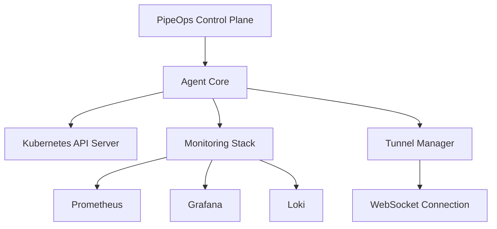

# PipeOps Kubernetes Agent Documentation

<div class="version-info" style="background: var(--md-primary-fg-color--light); color: var(--md-primary-bg-color); padding: 10px; border-radius: 4px; margin-bottom: 20px;">
  <strong>Version:</strong> {{ config.extra.release_version }}
  <span style="margin-left: 20px;">
    <a href="{{ config.repo_url }}/releases" style="color: inherit; text-decoration: underline;">View All Releases</a>
  </span>
</div>

Welcome to the official documentation for the **PipeOps Kubernetes Agent** — a lightweight, intelligent agent that transforms your virtual machines into production-ready Kubernetes servers for seamless project deployment through PipeOps.

## What is PipeOps Kubernetes Agent?

The PipeOps Kubernetes Agent is a background service that:

- **VM to Server Transformation** - Converts any virtual machine into a Kubernetes-ready deployment server
- **PipeOps Integration** - Seamlessly connects your infrastructure to the PipeOps platform for secure management
- **Automated Setup** - Handles Kubernetes installation, configuration, and management automatically  
- **Secure Access** - Provides secure admin access via WebSocket tunnel (no inbound ports required)
- **Project Deployment** - Enables easy deployment of applications and services through PipeOps
- **Infrastructure Management** - Manages server resources, networking, and scaling automatically
- **Smart Gateway Proxy** - Automatic ingress management with intelligent routing (tunnel for private, direct for public clusters)

## Key Features

- **One-Click Server Setup** - Transform any VM into a deployment-ready server in minutes
- **Secure Cluster Access** - WebSocket tunnel for secure admin access without inbound firewall rules
- **Comprehensive Monitoring** - Built-in monitoring stack with Grafana, Prometheus, and Loki (optional)
- **Secure Communications** - Encrypted connections to PipeOps platform with enterprise-grade security
- **PipeOps Gateway Proxy** - Automatic ingress route discovery with smart routing detection (enabled by default)
- **Dual Routing Modes** - Direct routing for public clusters (3-5x faster) or tunnel for private clusters
- **Multi-Project Support** - Deploy and manage multiple applications on a single server
- **Auto-Scaling** - Intelligent resource management and automatic scaling based on demand
- **Zero-Downtime Deployments** - Seamless updates and rollbacks without service interruption

## Quick Navigation

=== "Getting Started"

    - [Installation](getting-started/installation.md) — Linux installation (Ubuntu, Debian, RHEL)
    - [Windows Installation](getting-started/windows-installation.md) — Complete Windows 10/11 setup with WSL2
    - [Multi-VM Cluster Setup](getting-started/multi-vm-cluster.md) — High availability and disaster recovery
    - [Quick Start](getting-started/quick-start.md) — Get up and running in minutes
    - [Configuration](getting-started/configuration.md) — Configure your cluster environment
    - [Management](getting-started/management.md) — Upgrade, uninstall, and manage your agent

=== "Advanced"

    - [Architecture](ARCHITECTURE.md) - System architecture and design
    - [PipeOps Gateway Proxy](advanced/pipeops-gateway-proxy.md) - Optional external access for private clusters
    - [Monitoring](advanced/monitoring.md) - Advanced monitoring setup
    - [Gateway API Setup](advanced/gateway-api-setup.md) - Configure Gateway API and Istio for TCP/UDP routing
    - [Region Detection & GeoIP](geoip-registry-selection.md) - Automatic region detection

=== "Development"

    - [Local Development](local-development.md) — Development environment setup
    - [Contributing](development/contributing.md) — Contribute to the project

## Quick Start

Transform your VM into a deployment server in a few steps:

1. **Set your PipeOps token and install**:
   ```bash
   export PIPEOPS_TOKEN="your-pipeops-token"
   export CLUSTER_NAME="my-pipeops-cluster"
   # For production k3s: use 'sudo bash'
   # For development (k3d/kind/minikube): use 'bash' (no sudo)
   curl -fsSL https://get.pipeops.dev/k8-install.sh | bash
   ```

2. **Agent automatically handles everything**:
   ```bash
   # Service starts automatically and:
   # - Installs K3s Kubernetes
   # - Connects to PipeOps platform
   # - Sets up monitoring stack
   # - Registers your server
   ```

3. **Deploy applications through PipeOps dashboard**:
   ```bash
   # Your VM is now ready to receive deployments
   # Use the PipeOps web dashboard to deploy applications
   # Everything is handled automatically
   ```

4. **Monitor through built-in dashboards**:
   ```bash
   # Access monitoring at http://your-server:3000
   # View logs, metrics, and application status
   ```

## What's New

!!! tip "Latest Updates"

    - **v2.1.0**: Enhanced monitoring with custom metrics support
    - **Multi-arch support**: Now supports ARM64 and x86_64 architectures (works on Raspberry Pi!)
    - **Improved security**: mTLS encryption for all communications with PipeOps platform
    - **Better automation**: Fully automated Kubernetes setup and configuration

## Supported Virtual Machine Platforms

| Platform | Architecture | Status | Notes |
| -------- | ------------ | ------ | ----- |
| Ubuntu/Debian | x86_64   | ✅     | Recommended for production |
| Ubuntu/Debian | ARM64    | ✅     | Great for Raspberry Pi servers |
| CentOS/RHEL   | x86_64   | ✅     | Enterprise Linux support |
| Amazon Linux  | x86_64   | ✅     | AWS EC2 optimized |
| Google COS    | x86_64   | ✅     | Google Cloud Platform |
| Windows (WSL2)| x86_64   | ✅     | Via Windows Subsystem for Linux |

## Deployment Options

Choose the deployment method that fits your infrastructure:

=== "Intelligent Installer"

    The easiest way to get started:

    ```bash
    # Automatically detects and installs the best cluster type
    curl -fsSL https://get.pipeops.dev/k8-install.sh | bash
    ```

    **Note:** k3s (production) requires root - use `sudo bash`. Development clusters (k3d/kind/minikube) must run as regular user without sudo.

    - Automatically detects your environment
    - Installs prerequisites and dependencies
    - Configures monitoring stack

=== "Helm Chart"

    For Kubernetes-native deployments:
    
    ```bash
    helm install pipeops-agent oci://ghcr.io/pipeopshq/pipeops-agent \
      --set agent.pipeops.token="your-pipeops-token" \
      --set agent.cluster.name="your-cluster-name"
    ```

=== "Docker"

    Run in containerized environments:
    
    ```bash
    docker run -d --name pipeops-agent \
      -v /var/run/docker.sock:/var/run/docker.sock \
      pipeops/agent:latest
    ```

=== "Binary"

    Direct installation from GitHub releases:
    
    ```bash
    # Download and install latest release
    wget https://github.com/PipeOpsHQ/pipeops-k8-agent/releases/latest/download/pipeops-agent-linux-amd64.tar.gz
    tar -xzf pipeops-agent-linux-amd64.tar.gz
    sudo mv pipeops-agent /usr/local/bin/
    ```

## Architecture Overview

The PipeOps Kubernetes Agent consists of several key components:



- **Agent Core**: Main orchestration engine
- **Tunnel Manager**: Secure communication with control plane
- **Monitoring Stack**: Observability and metrics collection
- **Kubernetes Integration**: Native K8s resource management

## Community & Support

- **Documentation**: Comprehensive guides and API references
- **Issues**: [GitHub Issues](https://github.com/PipeOpsHQ/pipeops-k8-agent/issues)
- **Discussions**: [GitHub Discussions](https://github.com/PipeOpsHQ/pipeops-k8-agent/discussions)
- **Enterprise Support**: Contact [enterprise@pipeops.io](mailto:enterprise@pipeops.io)
- **Website**: [pipeops.io](https://pipeops.io)

## Security & Compliance

The PipeOps Kubernetes Agent is built with security as a first-class concern:

- **mTLS Encryption**: All communications use mutual TLS
- **RBAC Integration**: Native Kubernetes role-based access control
- **Audit Logging**: Comprehensive audit trails for compliance
- **Secret Management**: Secure handling of sensitive configuration

---

Made with care by the PipeOps team
